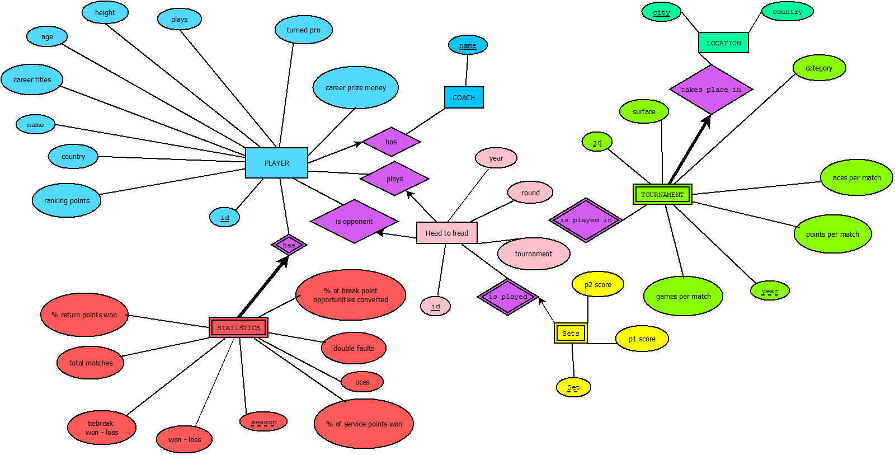

# Tenis
**Projekt pri predmetu OPB, 2015/16**

###Viri:
* [Igralci (top 100)](http://www.tennis.com/rankings/ATP/)

* [Osebna statistika igralcev](http://www.tennisabstract.com/cgi-bin/leaders.cgi?f=E1s00o1)

* [Turnirji](http://www.tennisscores-stats.com/tournament-description.php)

* [Trenerji](http://www.atpworldtour.com/en/players/coaches)

###Uporaba
* Zaženi samo 'uvoz/uvoz_csv_tabel.R', torej source-aj to skripto direkt ali iz zadnje vrstice v 'projekt.R' in zloadale se bodo vse tabele.
* Na skupno bazo se še ne moreš povezati!

